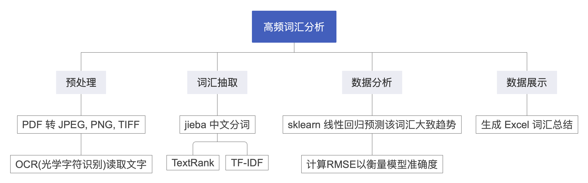
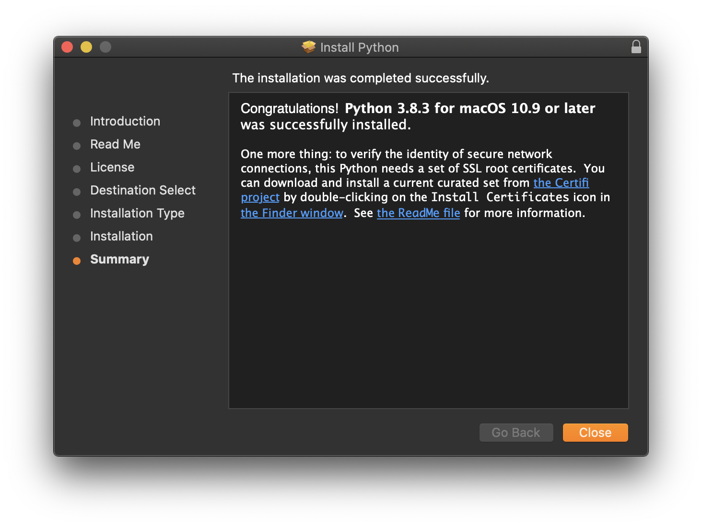
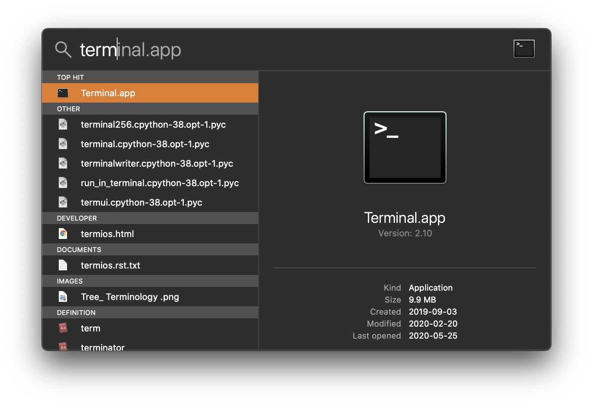
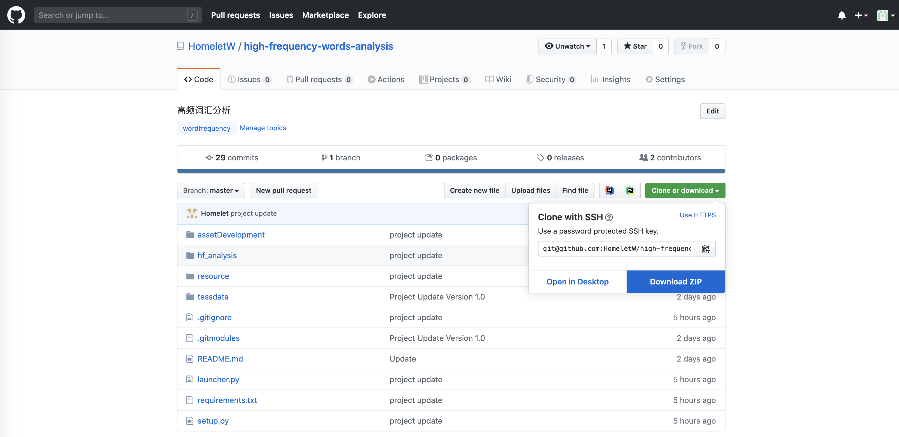

# 高频词汇分析 （hf_word_analysis)

## 项目概述



### 功能

## 项目依赖

`Pillow` python 图像处理

`pdf2image` pdf >> png, jpeg, tiff, ...

`docx2txt` 读取 word 文件

`XlsxWriter` 读取与编辑 excel 文件

`sklearn` 训练线性回归模型

`tesseract-ocr` 光学识别字符

`tesserocr` python 调用 tesseract-ocr API

`jieba` 中文分词，关键词抽取

## 如何安装

### MacOs

<h6 id="python_install"> Python 安装 </h6>

首先确保您的 Mac 已安装 python。请前往 <a href="https://www.python.org/downloads/">python 官方下载网站</a> 
进行下载，点击下载 python 3.8 或以上的版本（注意要 64bit 版）。下载后双击运行文件，一直点击下一步直到安装结束。



接下来我们验证 python 是否被正确安装。

<a name="open_terminal"></a>打开聚焦搜索（同时按下 Command + 空格键），输入 terminal.app



接下来输入 `python3 -V` 和 `pip3 -V`

````
➜  ~ python3 -V
Python 3.8.3
➜  ~ pip3 -V
pip 20.0.2 from ... (python 3.8)
````

如果返回结果类似于 `Python 3.8.3` 和 `pip 20.0.2` 说明您已经成功安装 Python 3.8.3！

<h6 id="homebrew_install"> Homebrew 安装 </h6>

接下来我们需要安装几个项目依赖库，我们将使用包管理工具 Homebrew 来协助我们安装。请接着打开 terminal.app 且输入以下命令：

`/bin/bash -c "$(curl -fsSL https://raw.githubusercontent.com/Homebrew/install/master/install.sh)"`

如果程序提醒 "Press Enter to continue"，请按下回车键。以下是示例结果：
````
➜  ~ /bin/bash -c "$(curl -fsSL https://raw.githubusercontent.com/Homebrew/install/master/install.sh)"
==> This script will install:
/usr/local/bin/brew
/usr/local/share/doc/homebrew
/usr/local/share/man/man1/brew.1
/usr/local/share/zsh/site-functions/_brew
/usr/local/etc/bash_completion.d/brew
/usr/local/Homebrew

Press RETURN to continue or any other key to abort  ---> 请按 Enter 键 <---
==> Downloading and installing Homebrew...
...
==> Installation successful!
...
````

<h6 id="poppler_install"> poppler 安装 </h6>

接下来请输入以下命令来安装 `poppler` 库提供关于 PDF 处理支持。

`brew install poppler`

以下是示例结果：

````
➜  ~ brew install poppler 
==> Downloading https://homebrew.bintray.com/bottles/poppler-0.88.0.catalina.bot
...
==> Pouring poppler-0.88.0.catalina.bottle.tar.gz
🍺  /usr/local/Cellar/poppler/0.88.0: 459 files, 24.9MB
````

<h6 id="tesseract_install"> tesseract 安装 </h6>

接下来请输入以下命令来安装 `tesseract` 库提供关于光学字符识别（OCR）支持。

`brew install tesseract`

以下是示例结果：
````
➜  ~ brew install tesseract 
==> Downloading https://homebrew.bintray.com/bottles/tesseract-4.1.1.catalina.bo
...
==> Pouring tesseract-4.1.1.catalina.bottle.tar.gz
==> Caveats
This formula contains only the "eng", "osd", and "snum" language data files.
If you need any other supported languages, run `brew install tesseract-lang`.
==> Summary
🍺  /usr/local/Cellar/tesseract/4.1.1: 65 files, 29.6MB
````

<h6 id="poppler_install"> 主体程序安装 </h6>

接下来我们将安装主体程序，前往<a href="https://github.com/HomeletW/high-frequency-words-analysis">高频词汇分析 github 主页</a>（或者您已经在这个页面，请翻到页面顶端），
点击绿色按钮 `Clone or download` 然后选择 `Download ZIP`，然后请稍后zip文件包的下载（大约 100 MB）。



接下来将文件包移动到您喜欢的位置（例如，桌面）然后双击解压。

## 常见问题

#### 1. Unable to get Page Count, is poppler installed?
