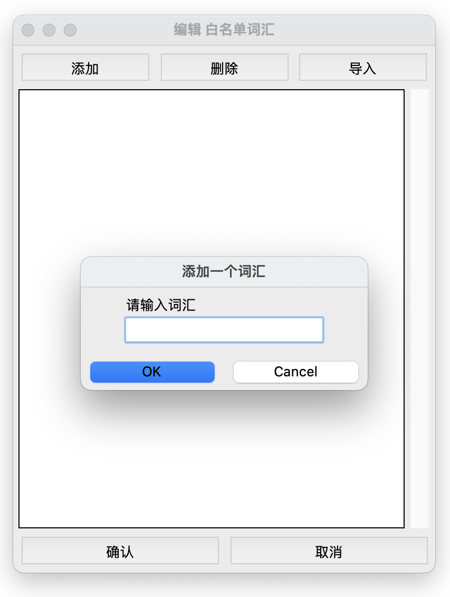
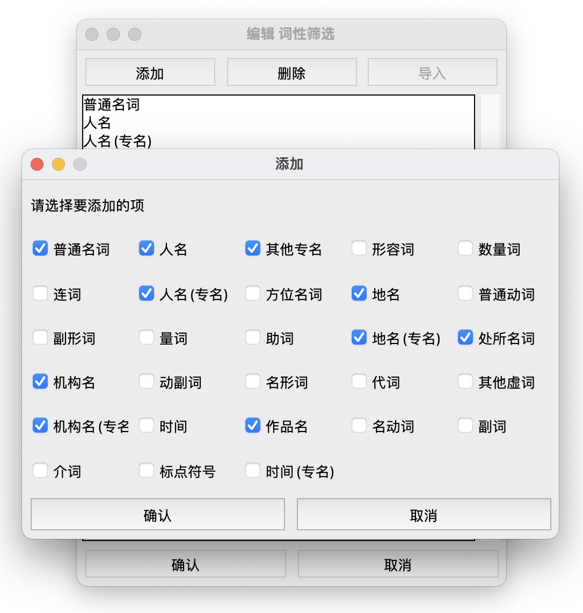
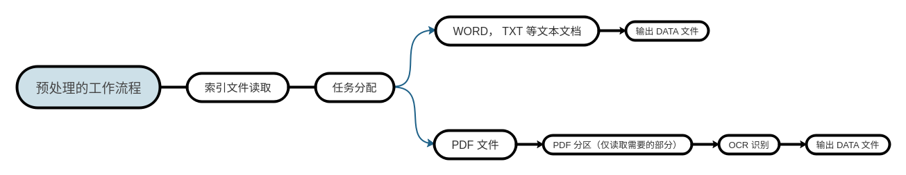
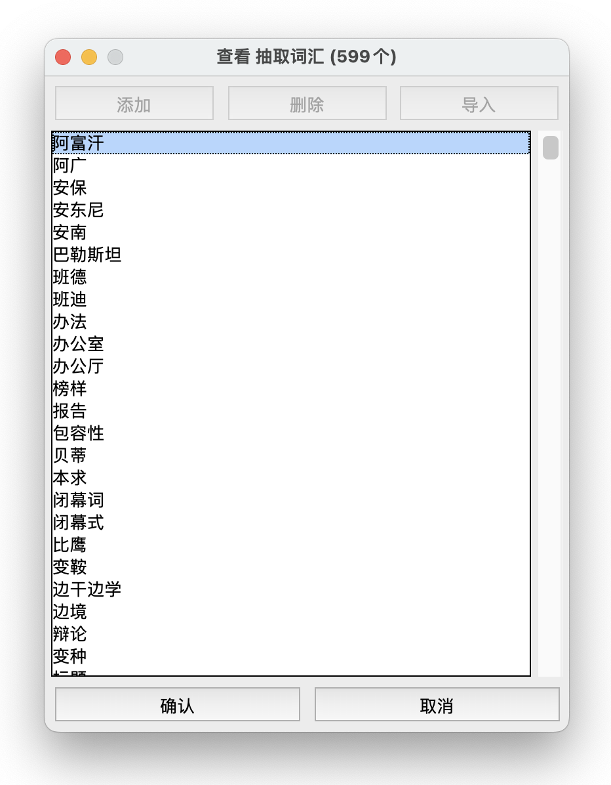
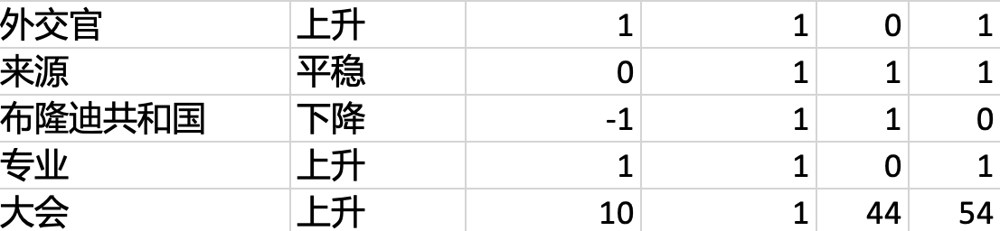

# 高频词汇分析 （hf_word_analysis)

- <a href="#项目概述">项目概述</a>
- <a href="#如何安装">如何安装</a>
- <a href="#界面与功能介绍">界面与功能介绍</a>
- <a href="#使用教程">使用教程</a>
- <a href="#常见问题">常见问题</a>
- <a href="#changelog">Change Log</a>

## 项目概述

高频词汇分析是一款开源词汇频率分析软件。主要功能包括：PDF 中文文字提取，文章关键字提取，简单趋势分析，以及输出数据到 excel 文档。
开发语言为 python，使用 tkinter GUI 打造的界面帮助简单参数配置。


## 如何安装

> 目前仅支持Macos安装

项目依赖

<table style="width:100%">
    <tr>
        <th>依赖包</th>
        <th>说明</th>
    </tr>
    <tr>
        <th>Pillow</th>
        <th>python 图像处理</th>
    </tr>
    <tr>
        <th>pdf2image</th>
        <th>pdf 转成 png, jpeg, tiff</th>
    </tr>
    <tr>
        <th>docx2txt</th>
        <th>读取 word 文件</th>
    </tr>
    <tr>
        <th>XlsxWriter</th>
        <th>读取与编辑 excel 文件</th>
    </tr>
    <tr>
        <th>sklearn</th>
        <th>创建线性模型</th>
    </tr>
    <tr>
        <th>tesseract-ocr</th>
        <th>光学识别字符</th>
    </tr>
    <tr>
        <th>tesserocr</th>
        <th>python 调用 tesseract-ocr API</th>
    </tr>
    <tr>
        <th>jieba</th>
        <th>中文分词，关键词抽取</th>
    </tr>
</table>

### python与pip安装

请前往 <a href="https://www.python.org/downloads/">python 官方下载网站</a> 
进行下载，点击下载 python 3.8 或以上的版本（注意要 64bit 版）。下载后双击运行文件，一直点击下一步直到安装结束。


接下来我们验证 python 与 pip 是否被正确安装。

首先<a href="#如何打开终端appTerminalapp">打开 终端.app（Terminal.app）</a>，接下来输入 `python3 -V` 并按回车键

```
➜  ~ python3 -V
Python 3.8.3
```

接下来输入 `pip3 -V` 并按回车键

```
➜  ~ pip3 -V
pip 20.0.2 from ... (python 3.8)
```

如果返回结果类似于 `Python 3.8.3` 和 `pip 20.0.2` (Python 版本号应高于3.8.3) 说明您已经成功安装 Python！

### 高频词汇分析安装

接下来我们将安装主体程序，前往[发布版本列表](release)来选择安装版本，或者直接下载[推荐版本](https://github.com/HomeletW/high-frequency-words-analysis/blob/master/release/V%200.2.2/%E9%AB%98%E9%A2%91%E8%AF%8D%E6%B1%87%E5%88%86%E6%9E%90_release_0.2.2.zip?raw=true)。

解压zip，打开文件夹，找到 `install.sh` 文件，<a href="#如何运行sh文件">然后运行 `install.sh`</a>

### 高频词汇分析运行

找到高频词汇分析的安装文件夹，找到 `run.sh` 文件, <a href="#如何运行sh文件">然后运行 `run.sh`</a>

## 界面与功能介绍

当您打开高频词汇分析软件时，以下页面将会被展示：


软件主页面包括以下几个部分：

- 参数面板：所有可配置的参数都在这个面板上，该面板还包括几个副面板，详情请见<a href="#参数面板及可配置参数">参数面板以及可配置参数</a>。
- 进度面板：进度面板描述了现在正在进行的任务，以及任务的状态，详情请见<a href="#进程面板">进程面板</a>。
- 控制面板：控制面板是所以任务按钮所在的面板，详情请见<a href="#控制面板">控制面板</a>。
- 状态面板：状态面板是反应详细的程序状态以及任务状态的窗口，详情请见<a href="#状态面板">状态面板</a>。
- 版本号：程序的版本号

### 参数面板及可配置参数
参数面板包含以下几个副面板：
- 文件选择
    - 根目录选择
        - （必填项）选择根目录，更多关于<a href="#创建根目录">根目录</a>
    - 索引文件选择
        - （必填项）选择索引文件，更多关于<a href="#索引文件格式">索引文件</a>
    - 附加参数文件选择
        - 选择索引文件，更多关于<a href="#附加参数文件格式">附加参数文件</a>
- pdf处理
    - 处理引擎
        - 一共有两个选项，各代表使用两个不同的库来处理pdf
        - pdftoppm（默认）
        - pdftocairo：可能在大型文件中性能有提升
    - 扫描格式
        - jpeg（推荐，默认）：文件较小，性能平均
        - png：文件较大，性能平均
        - tiff：文件最大，无压缩，还原度高
    - 扫描 DPI
        - DPI 是 Dots Per Inch（每英寸点数）的简称。DPI 越大，图像还原度越高。
        - 300（默认），400，500，600
- ocr优化
    - ocr 优先级
        - 优先速度：使用 <a href="https://github.com/tesseract-ocr/tessdata_fast">`tessdata/fast`</a> 来作为训练模型。该存储库包含Tesseract开源OCR引擎的训练模型的快速整数版本。
        - 平均（默认）：使用 <a href="https://github.com/tesseract-ocr/tessdata">`tessdata/default`</a> 来作为训练模型。该存储库包含Tesseract开源OCR引擎的训练模型的默认版本，支持旧版和LSTM OCR引擎。
        - 优先质量：使用 <a href="https://github.com/tesseract-ocr/tessdata_best">`tessdata/best`</a> 来作为训练模型。该存储库包含Tesseract开源OCR引擎的训练模型的最好版本。
    - ocr 默认语言
        - 默认语言：当无附加参数时使用的识别语言，更多关于<a href="#附加参数文件格式">附加参数</a>
            - 简体中文，繁体中文
- jieba优化
    - 抽取词汇数目
        - 可以选择最多抽取 1 ~ 1000 个词，或无限制。
    - 高频词汇抽取器
        - 选择抽词算法，支持:
            - TF-IDF
            - TextRank
- 词汇编辑
    - 词性筛选
        - 筛选抽取的词性，例如, 名字，动词，人名，...
    - 建议词汇
        - 列举词汇建议以方便抽取器工作。
    - 白名单词汇
        - 列举手动添加的词汇，这些词汇会被记入统计。
    - 黑名单词汇
        - 列举不想要出现在汇报里的词汇，这些词汇不会被记入统计
- 统计分析器
    - 趋势分析器
        - 利用线性模型的斜率系数来分析词汇大致趋势。




### 进程面板
进程面板包括两个部分：
- 任务描述
    - 任务描述包括了关于进程大部分信息，包括预计剩余时间（有可能不准确）。
- 任务处理进程
    
以下是一个进程面板的示例：


### 控制面板
控制面板是开始任务的端口，里面包括了所有任务的对应按钮：
1. <a href="#预处理">预处理</a>
2. <a href="#装载数据">装载数据</a>
3. <a href="#抽取词汇">抽取词汇</a>
4. <a href="#统计分析">统计分析</a>
5. <a href="#输出">输出</a>

任务之间是有先后顺序的。当刚开启软件时，有些任务会被禁用，只有完成了其之前的任务才可以开始下一任务。
例如：*统计分析* 是不可以执行的，的直到 *抽取词汇* 执行完成。
同理，如果重新执行了 *装载数据*，在其之后的 *统计分析*，*输出* 都将被禁用。


如果在任务处理途中有错误发生，该任务线程会马上退出，一个窗口会弹出并告知用户错误详情。
请详细查看错误报告，并在<a href="#常见问题">常见问题</a>里寻找对应的解决办法，如果还未能解决请<a href="mailto:homeletwei@gmail.com">联系开发者</a>。


注意事项：
- 当开始一项任务时，与该任务相关的一些参数面板会被禁用。
- __任务线程一旦开始就不可以手动停止。如果想要强制终止任务，请关闭软件然后重新开始。__

控制面板包括了一些辅助功能：
- <a href="#校对预处理">校对预处理</a>，按下将会打开电脑上的 `根目录/data` 文件夹方便用户校对。
- <a href="#初步检查词汇">初步检查词汇</a>，按下会打开一个界面显示已经被抽取的词汇（可以忽略这步）。

控制面板还包括一些其他功能型的复选框：
- 自动开始下一步骤
    - 选中之后将在完成一个任务后一秒钟自动开始下一个任务。
- 输出统计细节
    - 选中之后将在输出的 excel 文件中包括一些统计细节（斜率系数，R方）

### 状态面板
状态面板反应详细的程序状态以及任务状态的窗口，所有的任务信息都会显示在这里，包括 任务信息，错误信息，...


## 使用教程


以下为操作流程:

1. <a href="#创建根目录">创建根目录</a>
1. <a href="#准备数据">准备数据</a>
1. <a href="#创建索引">创建索引</a>
1. <a href="#启动高频词汇分析">启动高频词汇分析</a>
1. <a href="#预处理">预处理</a>
1. <a href="#校对预处理">校对预处理</a>
1. <a href="#装载数据">装载数据</a>
1. <a href="#抽取词汇">抽取词汇</a>
1. <a href="#词汇检查">词汇检查</a>
1. <a href="#统计分析">统计分析</a>
1. <a href="#输出">输出</a>

### 创建根目录

根目录是作为处理结果已经处理副产物储存的目录，以下称为 "根目录"。

根目录是我们分析过程中必不可少的，在分析过程中根目录里可能会用到的副目录：

- `根目录/resource`：这里是我们所有要被分析的源文件的所在之地，在索引文件里用到的文件应都在这里。
- `根目录/data`：这里是程序预处理完成后所有处理文件都将会被保存在这里。
- `根目录/temp`：这里是程序预处理时要用到的pdf扫描文件被保存的地方。（这个文件夹可能会占用很多电脑空间，可以定期删除里面的文件）

创建根目录以及以上提及的副目录。

### 准备数据

接下来我们需要在根目录里面创建一个子文件夹，并命名为 `resource`。
然后把所有会用到的源文件（分析文件）移动到 `resource` 文件夹下。

### 创建索引

现在我们需要创建两个文件，索引文件 和 附加参数文件。这两个文件格式为.xlsx/.xls（Excel 文件）。
索引文件是用于告诉程序想要分析的数据的具体信息，包括数据的具体位置以及类别。

附加参数文件是用于声明对与每个文件的额外参数，包括裁减参数与识别语言。

_注意：附加参数文件是用于帮助更好的分析您的数据，如果没有需要，这个文件是可以被省略的。_

#### 索引文件格式
<table style="width:100%">
  <tr>
    <th>名字</th>
    <th>文件地址</th>
    <th>类别</th>
    <th>排序代码</th>
    <th>开始页码</th>
    <th>结束页码</th>
    <th>附加参数</th>
  </tr>
  <tr>
    <td>中国共产党党章（七大）</td>
    <td>data.pdf</td>
    <td>七大</td>
    <td>7</td>
    <td>487</td>
    <td>504</td>
    <td>CROP=210/280/2300/3050｜LANG=chi_sim</td>
  </tr>
</table>

请参考[_索引文件模板_](resource/template/index.xlsx)。

参数具体含义：

- 名字：数据的名字
- 文件地址：数据所在文件的名字，请加入文件后缀 .docx，.pdf 之类（注意，请确保该文件在 `根目录/resource` 下存在，如果没有请把该文件复制到 `根目录/resource`）
- 类别：这个数据所属于的类别，相同类别的数据将会被归成一类。
- 排序代码：一个数字代表这个数据所属类别的排序代码，相同类别的数据必须拥有相同的排序代码
- 开始页码：一个数字代表数据在 PDF 文件中开始的页码。如果文件格式为.docx（word 文档）这个值将会被忽略。注意这个页码为真实页码，可能与 PDF 中角标页码不符（请确保 开始页码 小于等于 结束页码）。
- 结束页码：一个数字代表数据在 PDF 文件中结束的页码。如果文件格式为.docx（word 文档）这个值将会被忽略。注意这个页码为真实页码，可能与 PDF 中角标页码不符（请确保 结束页码 大于等于 开始页码）。
- 附加参数：对于这个文件的具体附加参数，如果这个参数不为空，附加参数文件的参数会被暂时覆盖。
    - 格式为：CROP=210/280/2300/3050｜LANG=chi_sim，用 `|` 隔开参数，具体关于附加参数，请查看 附加参数文件格式。

#### 附加参数文件格式
<table style="width:100%">
  <tr>
    <th>文件地址</th>
    <th>裁剪参数</th>
    <th>识别语言</th>
  </tr>
  <tr>
    <td>data.pdf</td>
    <td>CROP=210/280/2300/3050</td>
    <td>LANG=chi_sim</td>
  </tr>
</table>

请参考[_附加参数文件模板_](resource/template/additioanl_pram.xlsx)。

参数具体含义：

- 文件地址：文件的名字，这一项与索引文件里文件地址规则相同。
- 裁剪参数：这一参数的作用是通过裁剪扫描图片的方式，帮助程序过滤掉一些无用的信息。
    - 格式为：`CROP=x/y//height`
         
- 识别语言：这一参数的作用是设定一个识别语言，来更好的识别数据。
    - 目前支持的语言有
        - 简体中文：chi_sim
        - 繁体中文：chi_tra
    - 选择语言时应遵守以下规则以增加识别准确度
        - 尽量准确选择可能出现的语言
        - 尽量排除不会出现的语言来减少干扰
    - 关于 Tesseract-ocr 支持语言请前往：<a href="https://github.com/tesseract-ocr/tessdoc">tesseract doc</a>
    - 格式为：`LANG=语言1+语言2`
        

#### 裁剪参数用途
比如说在某些 PDF 文件里每一页会出现的页眉，页脚，页码，假如这些是一些我们不想要的干扰数据，


我们可以通过设定一个裁剪参数使这些干扰数据不被识别。

### 启动高频词汇分析

请<a href="#高频词汇分析运行">打开高频词汇分析软件</a>，然后将刚刚准备好的 *根目录*，*索引文件* 以及 *附加参数文件*（附加参数文件可以省略），输入到软件中。

在<a href="#参数面板">参数面板</a>上，找到 *文件选择* 然后单击 *选择 根目录*，然后在对话框中选择您创建的根目录。

接下来同样在 *文件选择* 中单击 *选择 索引文件*，然后在对话框中选择您创建的索引文件。

最后同样在 *文件选择* 中单击 *选择 附加参数文件*，然后在对话框中选择您创建的索引文件。

### 预处理

当您已经完成了前几步，您已经准备好开始进行预处理了。

请在<a href="#控制面板">控制面板</a>上，找到 *预处理* 按钮，单击即开始预处理任务。

注意事项：
- 预处理任务可能会花费很久时间。
- 当您已经进行过预处理了，并且不想重新分析一边数据（会覆盖之前预处理的结果），预处理任务是可以跳过的，那么请直接开始<a href="#装载数据">装载数据</a>。
- 预处理所产生的的扫描文件（.png, .jpeg, .tiff）会被保存在 `根目录/temp`，使用久了可能会占用很多内存，请定期清理。

### 校对预处理

预处理的任务是帮助我们统一归纳数据，他会把所有的数据文件转化为 DATA 文件并保存在 `根目录/data` 下以便以后校对与分析。



首先预处理进程会读取 *索引文件* 和 *附加参数文件* 并且分配任务。word 文档，txt文件等文本文档会被直接输出成 DATA 文件。
接下来的任务就是帮助我们把正常无法提取文字的扫描版 PDF 文件的部分，利用 OCR（Optical Character Recognition，光学字符识别）技术提取文字并转化为 DATA 文件。

但是请注意，OCR 技术 无法 100% 准确的识别文字（平均准确度在 80%～90%）。
当然有一些设置可以帮助 OCR 来提升识别文字的准确度，比如用更高的 DPI 扫描 pdf 文件。
但是这些方法都无一例外存在弊端，会导致处理时间的曾长或者消耗更多电脑内存。所以*人工校对*是确保准确度的另一办法。

以下是一个示例 DATA 文件：
```
# 可信度 | 行内容 （请校对识别内容，特别注意带有 ？ 的行）
#============== 页码: 33, 平均可信度: 89.68 ==============
#文件地址: /home/homelet/Desktop/数据/temp/data-300-0033.png
  90.57 | 中国共产党宣言
? 84.89 | 《一九二O〇年十一月)
  92.08 | 亲爱的同志们!这个宣言是中国共产党在去年十一月间决定的。这宣言的
  94.31 | 内容不过是关于共产主义原则的一部分，因此没有向外发表，不过以此为收纳
  93.34 | 党员之标准。这宣言之中文原稿不能在此地找到，所以兄弟把他从英文稿翻译
  94.06 | 出来。决定这宣言之时期既然有一年多了，当然到现在须要有修改和添补的地
  91.33 | 方。我很希望诸位同志把这个宣言仔细研究一普，因为每一个共产主义者都得
  92.19 | 要注意这种重要的文件一一共产党宣言。并且会提出远东人民会议[2]中国代
  93.64 | 表团中之共产主义者组讨论。讨论的结果，将要供中国共产党的参考和采纳。
? 62.48 | Chang[3】]
  95.50 | 一九二一年十二月十日
? 83.38 | 1，共产主义者的理想
  93.04 | A.对于经济方面的见解共产主义者主张将生产工具一一机器工厂，原料，
  90.74 | 土地，交通机关等一一收归社会共有，社会共用。要是生产工具收归共有共用
...
#=================总体平均可信度 : 89.68==================
```

每一页 PDF 文档都对应着DATA 文件中的一个段落。每个段落的第一行展示了 *页码* 以及这一页的 *平均可信度*。紧接着第二行展示了这个行对应的文件地址。接下来的 n 行就是扫描内容（n 为这个页一共有多少行）。

每一行内容的格式为：
```
 行可信度 | 行内容
```
如果这一行的 *行可信度* 低于这一页的 *平均可信度*，在这一行的最前面将会标注 `?`。

**__要点：当我们进行人工校对时请重点注意前面带有 `?` 的行。__**

如果的行的开头符号为 `#`，这一行将成为注释行（程序不会识别）。例如：
```
#这是一行注释行，程序将不会识别这一行的内容。
```

### 装载数据

当预处理结束，或者之前已经进行过预处理。装载数据按钮会被激活。单击 *装载数据* 即开始装载数据任务。

装载数据的目的是程序用来读取预处理过的 DATA 数据的。首先他会读取索引文件，然后找到 `根目录/data` 文件夹并读取所有索引文件里提及到的 DATA 文件。

### 抽取词汇

当数据已经装载完成，*抽取词汇* 按钮就会被激活。单击 *抽取词汇* 即开始进行词汇抽取。

此时，文章会被分词算法分成词汇并收集每个词汇的出现频率。

### 词汇检查

当抽取词汇结束，您可以查看已经被抽取的词汇。单击 *检查词汇* 即可查看被抽取出来的词汇。



### 统计分析

当词汇抽取结束，*统计分析* 按钮就会被激活。单击 *统计分析* 即开始进行统计分析。

对于每个词汇，我们创建一个线性模型，x轴为词汇每个*类别*的频率数据，y轴为*类别的排序代码*，模型的*斜率系数*会被用来分析词汇频率趋势。该模型的R方数据也会被记录下来作为描述模型准确度的基准。

- __R方__ 描述了模型与数据的拟合度，范围为 (-♾️, 1]，总的来说：R方越接近于1说明模型越好。
    - R方 <= 0：说明模型预测能力差
    - R方  > 0：说明模型预测优于取数据平均水平
    - R方  = 1：说明模型能完美预测数据
    - https://zhuanlan.zhihu.com/p/143132259

请参考<a href="#索引文件格式">索引文件格式</a>来了解*类别*和*排序代码*。

### 输出

当统计分析结束，*输出* 按钮就会被激活。单击 *输出* 即开始装载数据任务。选择excel文件输出的位置，然后按确定。

每个词汇的趋势标签，以及每个类别里的频率数据都会被输出的excel文档中。如果*输出统计细节*被勾选的话，模型的斜率系数以及R方也会被输出。



## 常见问题

### 如何打开终端.app（Terminal.app）

方法一：
打开聚焦搜索（同时按下 Command + 空格键），输入 终端.app（Terminal.app），按下回车即可打开。


方法二：
Application 文件夹并搜索 终端.app（Terminal.app），双击即可打开。

### 如何运行.sh文件

方法一: 更改该 `.sh` 文件权限为 _可执行_,

```
chmod u+x install.sh
chmod u+x run.sh
```

方法二：使用 sh 命令

在<a href="#如何打开终端appTerminalapp">终端</a>对话框输入 `sh` 并且把 `.sh` 文件 拖入对话框中，然后按下回车键。


### 值错误

### Unable to get Page Count, is poppler installed?

首先<a href="#如何打开终端appTerminalapp">打开终端（Terminal.app）</a> 输入以下指令：

`brew unlink poppler && brew link poppler`

## Change log

`V0.3` 修复bug，更新 install.sh 和 run.sh

`V0.2` 改善 PDF 处理速度，运用多线程，修复编码问题。

`V0.1` 初版本发布
