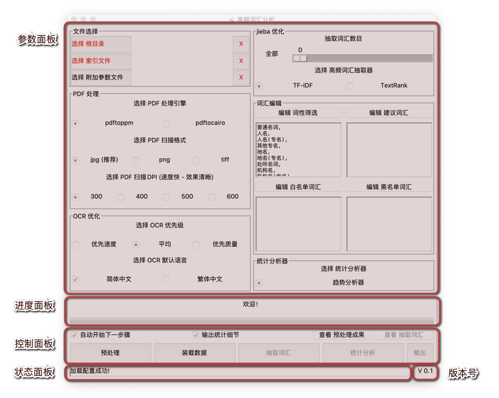
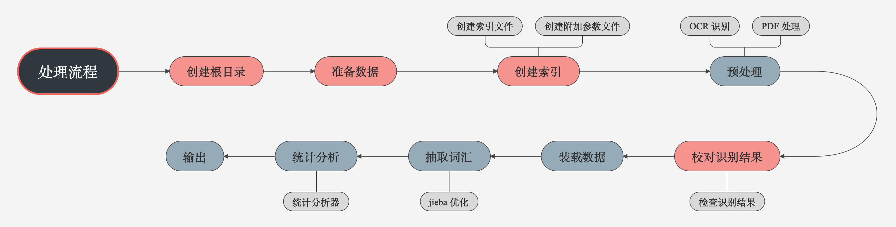
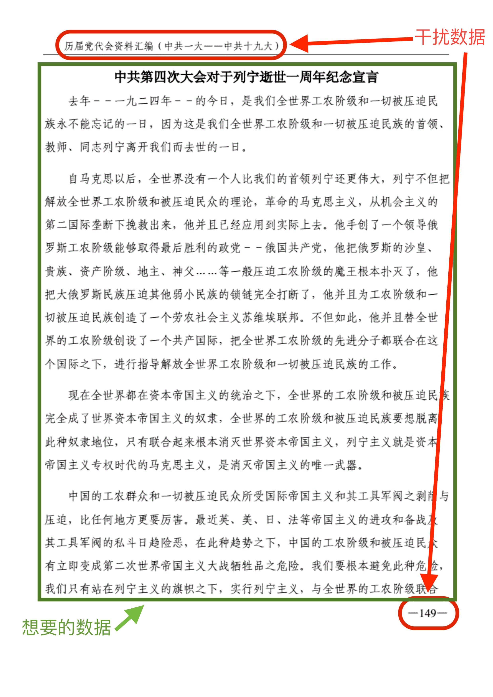

# 高频词汇分析 （hf_word_analysis)

- <a href="#项目概述">项目概述</a>
- <a href="#界面介绍">界面介绍</a>
    - <a href="parm_frame_and_parameters">参数面板以及可配置参数</a>
    - <a href="progress_frame">进程面板</a>
    - <a href="action_frame">控制面板</a>
    - <a href="status_frame">状态面板</a>
- <a href="#如何安装">如何安装</a>
    - <a href="#MacOs">MacOs</a>
- <a href="#项目概述">常见问题</a>

## 项目概述

高频词汇分析是一款开源词汇频率分析软件。主要功能包括：PDF 中文文字提取，文章关键字提取，简单趋势分析，以及输出数据到 excel 文档。
开发语言为 python，利用 tkinter GUI 打造的界面帮助简单参数配置。


## 界面与功能介绍

当您打开高频词汇分析软件时，以下页面将会被展示：



软件主页面包括以下几个部分：

- 参数面板：所有可配置的参数都在这个面板上，该面板还包括几个副面板，详情请见<a href="#parm_frame_and_parameters">参数面板以及可配置参数</a>。
- 进度面板：进度面板描述了现在正在进行的任务，以及任务的状态，详情请见<a href="#progress_frame">进程面板</a>。
- 控制面板：控制面板是所以任务按钮所在的面板，详情请见<a href="#action_frame">控制面板</a>。
- 状态面板：状态面板是反应程序状态以及任务状态的窗口，在该面板上提供了更多关于进行中任务和程序状态的信息，详情请见<a href="#status_frame">状态面板</a>。
- 版本号：程序的版本号

### 分析流程介绍



<h4 id="process_create_root_dir">创建根目录</h4>

如果想要开始分析首先我们需要一个根目录。
请在您喜欢的位置创建一个新的文件夹，并改成您喜欢的名字。

根目录是我们分析过程中必不可少的，在分析过程中根目录里可能会用到的副目录：

- `根目录/resource`：（这个目录是我们需要自己创建的）这里是我们所有要被分析的源文件的所在之地，在索引文件里用到的文件应都在这里。
- `根目录/data`：（这个目录是程序自动给我们创建的）这里是程序预处理完成后所有处理文件都将会被保存在这里。
- `根目录/temp`：（这个目录是程序自动给我们创建的）这里是程序预处理时要用到的pdf扫描文件被保存的地方。（这个文件夹可能会占用很多电脑空间，可以定期删除里面的文件）

<h4 id="process_prepare_data">准备数据</h4>

接下来我们需要在我们刚创建好的文件夹里面创建一个子文件夹，并命名为 `resource`。
然后把所有会用到的源文件（分析文件）移动到 `resource` 文件夹下。

<h4 id="process_indexing">创建索引</h4>

现在我们需要创建两个文件，索引文件 和 附加参数文件。这两个文件格式为.xlsx/.xls（Excel 文件）。
索引文件是用于告诉程序想要分析的数据的具体信息，附加参数文件是用于告诉程序一些附加的参数。

<h5 id="process_indexing_index_format">索引文件格式为：</h5>
<table style="width:100%">
  <tr>
    <th>名字</th>
    <th>文件地址</th>
    <th>类别</th>
    <th>排序代码</th>
    <th>开始页码</th>
    <th>结束页码</th>
    <th>附加参数</th>
  </tr>
  <tr>
    <td>中国共产党党章（七大）</td>
    <td>data.pdf</td>
    <td>七大</td>
    <td>7</td>
    <td>487</td>
    <td>504</td>
    <td>CROP=210/280/2300/3050｜LANG=chi_sim</td>
  </tr>
</table>
参数具体含义：

- 名字：数据的名字
- 文件地址：数据所在文件的名字，请加入文件后缀 .docx，.pdf 之类（注意，请确保该文件在 `根目录/resource` 下存在，如果没有请把该文件复制到 `根目录/resource`）
- 类别：这个数据所属于的类别，相同类别的数据将会被归成一类。
- 排序代码：一个数字代表这个数据所属类别的排序代码，相同类别的数据必须拥有相同的排序代码
- 开始页码：一个数字代表数据在 PDF 文件中开始的页码。如果文件格式为.docx（word 文档）这个值将会被忽略。注意这个页码为真实页码，可能与 PDF 中角标页码不符（请确保 开始页码 小于等于 结束页码）。
- 结束页码：一个数字代表数据在 PDF 文件中结束的页码。如果文件格式为.docx（word 文档）这个值将会被忽略。注意这个页码为真实页码，可能与 PDF 中角标页码不符（请确保 结束页码 大于等于 开始页码）。
- 附加参数：对于这个文件的具体附加参数，如果这个参数不为空，附加参数文件的参数会被暂时覆盖。
    - 格式为：CROP=210/280/2300/3050｜LANG=chi_sim，用 `|` 隔开参数，具体关于附加参数，请查看 附加参数文件格式。


<h5 id="process_indexing_add_parm_format">附加参数文件格式为：</h5>
<table style="width:100%">
  <tr>
    <th>文件地址</th>
    <th>裁剪参数</th>
    <th>识别语言</th>
  </tr>
  <tr>
    <td>data.pdf</td>
    <td>CROP=210/280/2300/3050</td>
    <td>LANG=chi_sim</td>
  </tr>
</table>
参数具体含义：

- 文件地址：文件的名字，这一项与索引文件里文件地址规则相同。
- 裁剪参数：这一参数的作用是通过裁剪扫描图片的方式，帮助程序过滤掉一些无用的信息。
    - 格式为：`CROP=x/y//height`

     

比如说在某些 PDF 文件里每一页会出现的页眉，页脚，页码，假如这些是一些我们不想要的干扰数据，



我们可以通过设定一个裁剪参数使这些干扰数据不被识别。
- 识别语言：这一参数的作用是设定一个识别语言，来更好的识别数据。
    - 格式为：`LANG=语言1+语言2`


目前支持的语言有
- 简体中文：chi_sim
- 繁体中文：chi_tra

选择语言时应遵守以下规则以增加识别准确度
1. 尽量准确选择可能出现的语言
2. 尽量排除不会出现的语言来减少干扰

关于 Tesseract-ocr 支持语言请前往：<a href="https://github.com/tesseract-ocr/tessdoc">tesseract doc</a>

<h4 id="process_preprocess">预处理</h4>
<h4 id="process_proof_read">校对识别结果</h4>
<h4 id="process_load_data">装载数据</h4>
<h4 id="process_word_extraction">抽取词汇</h4>
<h4 id="process_word_statistic">统计分析</h4>
<h4 id="process_output">输出</h4>


<h3 id="parm_frame_and_parameters">参数面板以及可配置参数</h4>

- 文件选择
    - 文件选择分为：根目录选择，索引文件选择，附加参数文件选择
- pdf处理
- ocr优化
- jieba优化
- 词汇编辑
- 统计分析器

<h3 id="progress_frame">进程面板</h4>
<h3 id="action_frame">控制面板</h4>
<h3 id="status_frame">状态面板</h4>

## 项目依赖

`Pillow` python 图像处理

`pdf2image` pdf >> png, jpeg, tiff, ...

`docx2txt` 读取 word 文件

`XlsxWriter` 读取与编辑 excel 文件

`sklearn` 训练线性回归模型

`tesseract-ocr` 光学识别字符

`tesserocr` python 调用 tesseract-ocr API

`jieba` 中文分词，关键词抽取

## 如何安装

### MacOs

<h4 id="python_install"> python 与 pip 安装 </h4>

请前往 <a href="https://www.python.org/downloads/">python 官方下载网站</a> 
进行下载，点击下载 python 3.8 或以上的版本（注意要 64bit 版）。下载后双击运行文件，一直点击下一步直到安装结束。


接下来我们验证 python 与 pip 是否被正确安装。

首先<a href="#h2_open_terminal">打开 终端.app（Terminal.app）</a>，打开聚焦搜索（同时按下 Command + 空格键），输入 Terminal.app


接下来输入 `python3 -V` 和 `pip3 -V`

````
➜  ~ python3 -V
Python 3.8.3
➜  ~ pip3 -V
pip 20.0.2 from ... (python 3.8)
````

如果返回结果类似于 `Python 3.8.3` 和 `pip 20.0.2` 说明您已经成功安装 Python 3.8.3！

<h4 id="homebrew_install"> Homebrew 安装 </h4>

在安装 高频词汇分析 之前我们需要安装几个项目依赖库，我们将使用包管理工具 Homebrew 来协助我们安装。
请首先打开<a href="#h2_open_terminal">终端（Terminal.app）</a>且输入以下命令：

`/bin/bash -c "$(curl -fsSL https://raw.githubusercontent.com/Homebrew/install/master/install.sh)"`

如果程序提醒 "Press Enter to continue"，请按下回车键。以下是示例结果：

如果程序提醒 "Enter Password"，请输入电脑密码然后按下回车键来继续安装。（注意，密码因为隐私原因，打出来的密码会不可见。这是正常现象，请继续输入。如果密码打错了，可以提前按下回车键即可重新尝试输入。）
````
➜  ~ /bin/bash -c "$(curl -fsSL https://raw.githubusercontent.com/Homebrew/install/master/install.sh)"
==> This script will install:
/usr/local/bin/brew
/usr/local/share/doc/homebrew
/usr/local/share/man/man1/brew.1
/usr/local/share/zsh/site-functions/_brew
/usr/local/etc/bash_completion.d/brew
/usr/local/Homebrew

Press RETURN to continue or any other key to abort  ---> 请按 Enter 键 <---
==> Downloading and installing Homebrew...
...
==> Installation successful!
...
````

<h4 id="poppler_install"> poppler 安装 </h4>

接下来请在<a href="#h2_open_terminal">终端（Terminal.app）</a>对话框输入以下命令来安装 `poppler` 库（提供关于 PDF 处理支持）。

`brew install poppler`

以下是示例结果：

````
➜  ~ brew install poppler 
==> Downloading https://homebrew.bintray.com/bottles/poppler-0.88.0.catalina.bot
...
==> Pouring poppler-0.88.0.catalina.bottle.tar.gz
🍺  /usr/local/Cellar/poppler/0.88.0: 459 files, 24.9MB
````

<h4 id="tesseract_install"> tesseract 安装 </h4>

接下来请在<a href="#h2_open_terminal">终端（Terminal.app）</a>对话框输入以下命令来安装 `tesseract` 库（提供关于光学字符识别（OCR）支持）。

`brew install tesseract`

以下是示例结果：
````
➜  ~ brew install tesseract 
==> Downloading https://homebrew.bintray.com/bottles/tesseract-4.1.1.catalina.bo
...
==> Pouring tesseract-4.1.1.catalina.bottle.tar.gz
==> Caveats
This formula contains only the "eng", "osd", and "snum" language data files.
If you need any other supported languages, run `brew install tesseract-lang`.
==> Summary
🍺  /usr/local/Cellar/tesseract/4.1.1: 65 files, 29.6MB
````

<h4 id="poppler_install"> 主体程序安装 </h4>

接下来我们将安装主体程序，前往<a href="https://github.com/HomeletW/high-frequency-words-analysis/tree/master/release">发布版本</a>来选择安装版本，或者直接下载<a href="https://github.com/HomeletW/high-frequency-words-analysis/blob/master/release/%E9%AB%98%E9%A2%91%E8%AF%8D%E6%B1%87%E5%88%86%E6%9E%90_release_0.1.zip?raw=true">推荐版本</a>。

接下来将下载好的 zip 文件移动到您喜欢的位置（例如，桌面）然后双击解压，并且将解压好的文件夹改成喜欢的名字。

！！注意：一旦程序设定完成，将不能改变该文件夹地址以及名字，所以要现在设置完成 ！！

双击打开该文件夹，找到 `install_script.sh` 文件。

现在请在<a href="#h2_open_terminal">终端（Terminal.app）</a>对话框输入 `sh` 并且把 `install_script.sh` 拖入对话框中，然后按下回车键。


以下是示例结果：
````
➜  ~ sh /Users/homelet/Desktop/high-frequency-words-analysis-master/install_script.sh
Working in /Users/homelet/Desktop/high-frequency-words-analysis-master
Installing Virtuelenv...
...
Creating Virtuelenv enviroment...
...
Installing Dependencies...
...
Installing collected packages: ...
Successfully installed ...
Prepare to build App...
...
*** creating application bundle: 高频词汇分析 ***
...
Done!
Finnished!
安装结束！已在 dist 文件夹里创造 高频词汇分析.app
````

恭喜您，您已经成功安装了高频词汇分析！

在结束安装之后，会自动弹出一个含有 <u>高频词汇分析.app</u> 的窗口，双击 <u>高频词汇分析.app</u> 来测试程序运行，
如果运行成功，程序主页面将会展示。

如果没有发现<u>高频词汇分析.app</u>，可能有以下几个原因:
1. 窗口失败弹出，请检查在目录下的 dist 文件夹，
2. 如果在 dist 文件夹还未发现<u>高频词汇分析.app</u>，说明安装失败，请联系开发者来获取更多信息，或者重新尝试上一步。


运行成功之后可以把 <u>高频词汇分析.app</u> 文件拖入 程序（Application）文件夹，来快速访问。

## 常见问题

<h3 id="h2_open_terminal">1. 如何打开 终端.app（Terminal.app)</h3>

<h5>方法1：</h5>
打开聚焦搜索（同时按下 Command + 空格键），输入 终端.app（Terminal.app），按下回车即可打开。


<h5>方法2：</h5>
Application 文件夹并搜索 终端.app（Terminal.app），双击即可打开。

<h3 id="h2_solve_poppler">2. Unable to get Page Count, is poppler installed?</h3>

首先<a href="#h2_open_terminal">打开终端（Terminal.app）</a> 输入以下指令：

`brew unlink poppler && brew link poppler`


